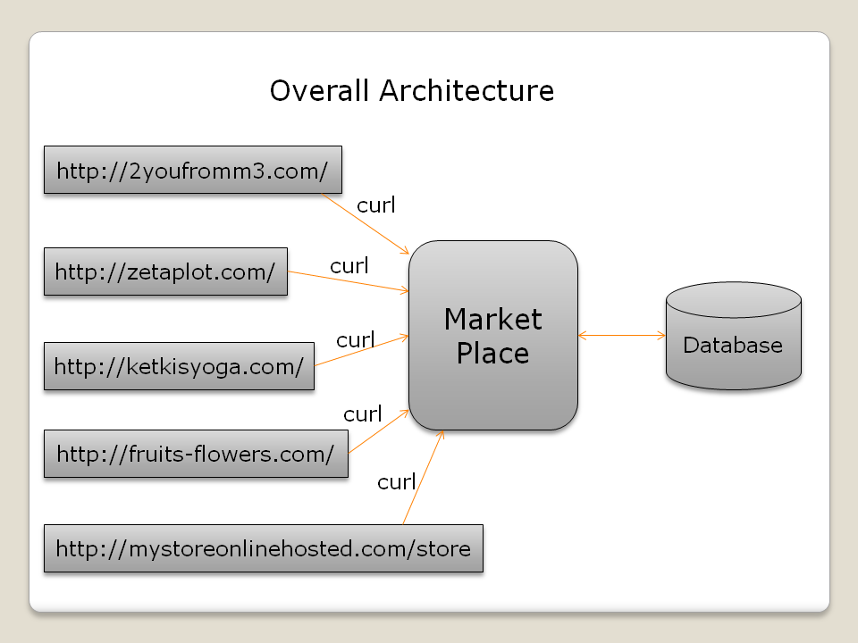

# CMPE272Project_MarketPlace
The website was created as a project requirement for CMPE272

## Cross Domain Online Market Place
This project of Market Place is supposed to be an e-commerce website which should feature all the products of the individual sites created by students in the due course of CMPE272.

## Architecture

## Video Demo: ::
https://youtu.be/6K_6x4uI8ck

## Features
* User Creation and Login
* Recently Visited Products for each member company and MarketPlace using cookies
* Add review and rating for all products
* Most visited products in each member company and MarketPlace
* Top rated products in each member company and MarketPlace
* Facebook Login
* Add to Cart
* Dynamic Product Display using curl

## Future Scope
* Providing checkout functionality.
* Adding other login API’s.

## Team Members
* Anubha Mandal (Individual site: http://2youfromm3.com/ )
* Ketki Bhusari
* Kshama nidhi
* Lakshmi Bharatula
* Praneetha devireddy
